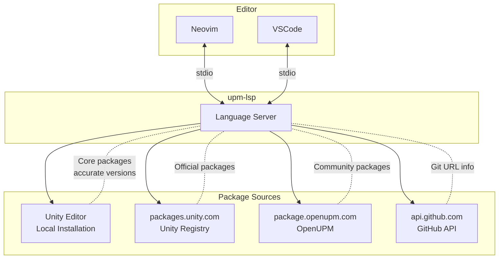

# upm-lsp

Language Server Protocol (LSP) implementation for Unity Package Manager `Packages/manifest.json`.

## Features

### Completion

- Package names from Unity Registry and OpenUPM
- Version numbers for packages
- Top-level keys (`dependencies`, `scopedRegistries`, `testables`, etc.)
- Scoped registry properties (`name`, `url`, `scopes`)

### Hover Information

- Package metadata (name, version, description, Unity compatibility)
- Built-in module information (com.unity.modules.*)
- GitHub repository details for git URL dependencies

### Diagnostics

- JSON syntax errors
- Unknown package warnings
- Invalid version detection
- Missing required fields in scoped registries
- Empty scopes array detection

## Supported Package Sources

| Source | Description | Features |
|--------|-------------|----------|
| Unity Registry | `packages.unity.com` | Completion, Hover, Validation |
| Unity Editor (Local) | Built-in packages from installed Unity Editor | Accurate version validation for core packages |
| OpenUPM | `package.openupm.com` | Completion, Hover, Validation |
| GitHub | Git URLs (`git+https://github.com/...`) | Hover (repo info, tags) |

### Unity Editor Integration

upm-lsp reads built-in packages directly from your local Unity Editor installation. This provides accurate version information for core packages like `com.unity.ugui`, `com.unity.textmeshpro`, etc., which are not available on the public registry.

Supported paths:
- macOS: `/Applications/Unity/Hub/Editor/*/`
- Windows: `C:\Program Files\Unity\Hub\Editor\*\`
- Linux: `~/Unity/Hub/Editor/*/`

## Installation

```bash
git clone https://github.com/bigdra50/upm-lsp.git
cd upm-lsp
npm install
npm run build
npm link  # makes 'upm-lsp' command available globally
```

## Editor Setup

### Neovim (nvim-lspconfig)

Add to your Neovim configuration:

```lua
-- Optional: Set filetype for manifest.json
vim.api.nvim_create_autocmd({ "BufRead", "BufNewFile" }, {
  pattern = "*/Packages/manifest.json",
  callback = function()
    vim.bo.filetype = "json.upm"
  end,
})

-- LSP configuration
local lspconfig = require("lspconfig")
local configs = require("lspconfig.configs")

if not configs.upm_lsp then
  configs.upm_lsp = {
    default_config = {
      cmd = { "upm-lsp", "--stdio" },
      filetypes = { "json", "json.upm" },
      root_dir = lspconfig.util.root_pattern("Packages/manifest.json", "Assets"),
      single_file_support = true,
    },
  }
end

lspconfig.upm_lsp.setup({})
```

### VSCode

VSCode extension is planned for future releases.

## Configuration

You can pass initialization options to customize behavior:

| Option | Type | Default | Description |
|--------|------|---------|-------------|
| `networkValidation` | boolean | `true` | Enable/disable remote package existence checks |

Example (nvim-lspconfig):

```lua
lspconfig.upm_lsp.setup({
  init_options = {
    networkValidation = false,  -- Disable network validation for faster diagnostics
  },
})
```

## Architecture

```
src/
├── server.ts                    # LSP entry point (stdio)
├── types.ts                     # Type definitions
├── providers/
│   ├── completionProvider.ts    # Package/version completion
│   ├── hoverProvider.ts         # Package info on hover
│   └── diagnosticProvider.ts    # Validation and diagnostics
├── services/
│   └── registryService.ts       # Registry orchestration and caching
├── registries/
│   ├── registryClient.ts        # Base class with LRU cache
│   ├── unityRegistry.ts         # packages.unity.com
│   ├── unityEditorRegistry.ts   # Local Unity Editor packages
│   ├── openUpmRegistry.ts       # package.openupm.com
│   └── githubRegistry.ts        # GitHub API for git URLs
└── utils/
    ├── jsonHelper.ts            # JSON parsing utilities
    └── versionUtils.ts          # Semver comparison
```

## Development

```bash
npm install       # Install dependencies
npm run build     # Build
npm run watch     # Watch mode (rebuild on changes)
npm test          # Run tests
npm link          # Link for local testing
```

## How It Works



## License

MIT
